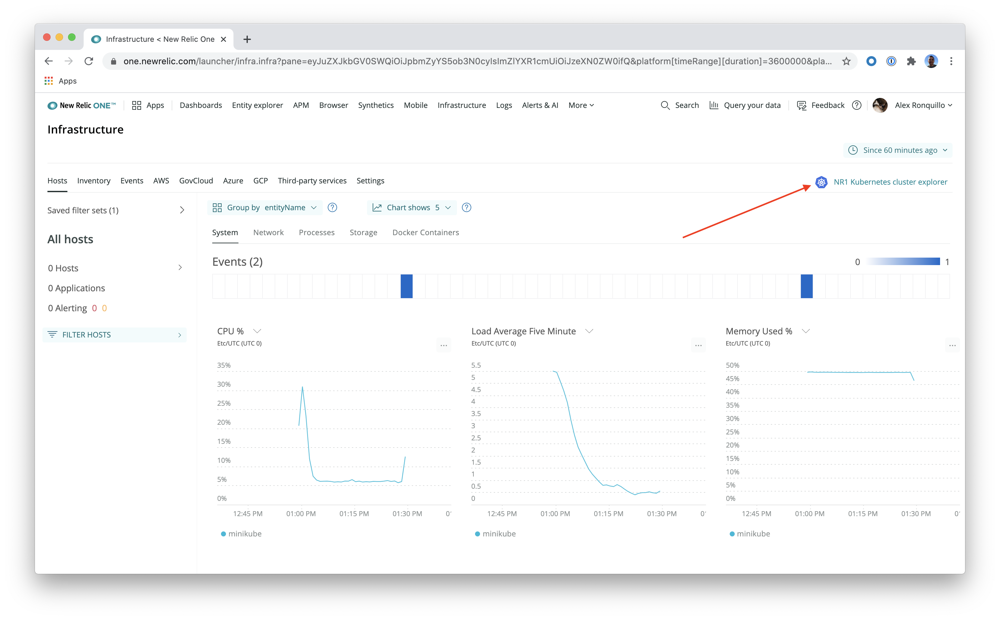
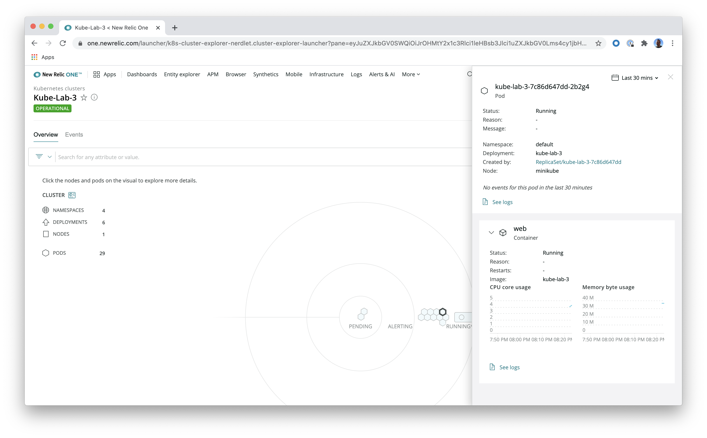

# Integrating New Relic with Kubernetes - Lab 3

Welcome! This lab correlates with the _Integrating New Relic with Kubernetes_ talk from Nerd Days 2020. It is the third of four hands-on labs you'll walk through in your session.

## Prerequisites

To complete this lab, you need:

- The local Kubernetes cluster you created in [lab 1](../kube-lab-1/README.md)
- [A New Relic account](https://newrelic.com/signup)

Once you have the necessary prerequisites, you may begin the lab.

## Instrument your service

In this lab, you'll instrument your Kubernetes cluster with New Relic using [custom manifests](https://docs.newrelic.com/docs/integrations/kubernetes-integration/installation/kubernetes-integration-install-configure#customized-manifest).

First, install `kube-state-metrics`:

```console
$ curl -L -o kube-state-metrics-1.9.5.zip https://github.com/kubernetes/kube-state-metrics/archive/v1.9.5.zip && unzip kube-state-metrics-1.9.5.zip && kubectl apply -f kube-state-metrics-1.9.5/examples/standard
...
clusterrolebinding.rbac.authorization.k8s.io/kube-state-metrics created
clusterrole.rbac.authorization.k8s.io/kube-state-metrics created
deployment.apps/kube-state-metrics created
serviceaccount/kube-state-metrics created
service/kube-state-metrics created
```

Second, download the infrastructure agent manifest:

```console
$ curl -O https://download.newrelic.com/infrastructure_agent/integrations/kubernetes/newrelic-infrastructure-k8s-latest.yaml
```

Replace `<YOUR_LICENSE_KEY>` and `<YOUR_CLUSTER_NAME>` in _newrelic-infrastructure-k8s-latest.yaml_:

```yaml
env:
  - name: "CLUSTER_NAME"
    value: "<YOUR_CLUSTER_NAME>"
  - name: "NRIA_LICENSE_KEY"
    value: "<YOUR_LICENSE_KEY>"
```

Use `Kube-Lab-3` for `<YOUR_CLUSTER_NAME>`.

You can find your license key at New Relic:

1. [Log in](https://one.newrelic.com/)
2. Navigate to _Account settings_ from your profile at the top right of the screen
3. Your License key is on the right side, under _Account information_

Next, create the Kubernetes resources:

```console
$ kubectl create -f newrelic-infrastructure-k8s-latest.yaml
serviceaccount/newrelic created
clusterrole.rbac.authorization.k8s.io/newrelic created
clusterrolebinding.rbac.authorization.k8s.io/newrelic created
daemonset.apps/newrelic-infra created
configmap/nri-default-integration-cfg created
configmap/nri-integration-cfg created
```

Finally, wait a few minutes and navigate to the [Kubernetes Explorer](https://docs.newrelic.com/docs/integrations/kubernetes-integration/understand-use-data/kubernetes-cluster-explorer):

1. [Log in](https://one.newrelic.com/)
2. Select _Infrastructure_ from the top navigation
3. Select _NR1 Kubernetes cluster explorer_ on the right side of the screen



Select the _Kube-Lab-3_ cluster:



> **Don't panic!** If you see a message about incomplete data for the cluster, refresh in a few minutes.

## Tear down

For the next lab, you need to tear down your instrumentation. You can remove all your resources from this lab by running `kubectl delete` on the same manifests you used to create the resources:

```console
$ kubectl delete -f kube-state-metrics-1.9.5/examples/standard
$ kubectl delete -f newrelic-infrastructure-k8s-latest.yaml
```

## Next Steps

Congratulations! You've successfully instrumented an app in Kubernetes using a custom manifest. You can use this method if you need more granular control over your resources. In the [final lab](../kube-lab-4/README.md), you'll learn how to instrument a Kubernetes cluster with Helm.