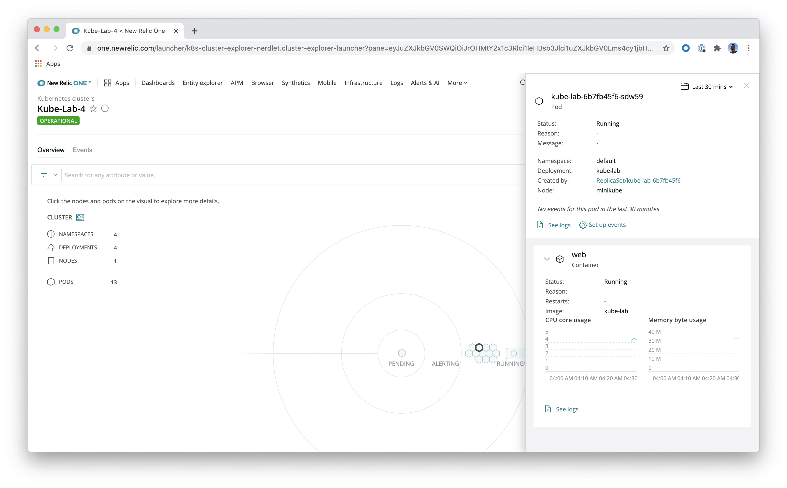

# Integrating New Relic with Kubernetes - Lab 4

Welcome! This lab correlates with the _Integrating New Relic with Kubernetes_ talk from Nerd Days 2020. It is the final hands-on lab you'll walk through in your session.

## Prerequisites

To complete this lab, you need:

- The local Kubernetes cluster you created in [lab 1](../kube-lab-1/README.md)
- [A New Relic account](https://newrelic.com/signup)
- [Helm](https://helm.sh/docs/intro/install/)

> **Note:** This lab uses Helm 3, if you're working on a project that uses Helm 2, please see [our documentation](https://docs.newrelic.com/docs/integrations/kubernetes-integration/installation/install-kubernetes-integration-using-helm) for relevant instructions.

Once you have the necessary prerequisites, you may begin the lab.

## Instrument your service

In this lab, you'll instrument your Kubernetes cluster with New Relic using our [Helm chart](https://docs.newrelic.com/docs/integrations/kubernetes-integration/installation/install-kubernetes-integration-using-helm).

First, add the New Relic Helm repository:

```console
$ helm repo add newrelic https://helm-charts.newrelic.com
```

Second, install the `newrelic-infrastructure` chart:

```console
$ helm install newrelic-bundle newrelic/nri-bundle \
    --set global.licenseKey=<YOUR_LICENSE_KEY> \
    --set global.cluster=Kube-Lab-4 \
    --namespace=default \
    --set newrelic-infrastructure.privileged=true \
    --set ksm.enabled=true
```

Don't forget to replace `<YOUR_LICENSE_KEY>` with your actual license key, which you can find at New Relic:

1. [Log in](https://one.newrelic.com/)
2. Navigate to _Account settings_ from your profile at the top right of the screen
3. Your License key is on the right side, under _Account information_

Finally, wait a few minutes and navigate to the [Kubernetes Explorer](https://docs.newrelic.com/docs/integrations/kubernetes-integration/understand-use-data/kubernetes-cluster-explorer):

1. [Log in](https://one.newrelic.com/)
2. Select _Infrastructure_ from the top navigation
3. Select _NR1 Kubernetes cluster explorer_ on the right side of the screen


Select the _Kube-Lab-4_ cluster:



> **Don't panic!** If you see a message about incomplete data for the cluster, refresh in a few minutes.

## Tear down

You can remove all your resources from this whole session by spinning down Minikube and deleting your cluster:

```console
$ minikube stop
$ minikube delete
```

## Next Steps

Congratulations! You've successfully instrumented an app in Kubernetes using Helm. You can also use the automated installer from [lab 2](../kube-lab-2/README.md) to generate the `helm install` command if you need more instrumentation! (Instead of selecting _Kubernetes manifest file_ for your install method, select _Helm_.)